# Request Free VM And Install Docker

## Reqeust a free VM

1. Go to [OnWorks website](https://www.onworks.net/) and select **Products & Features -> Ubuntu server** menu.

    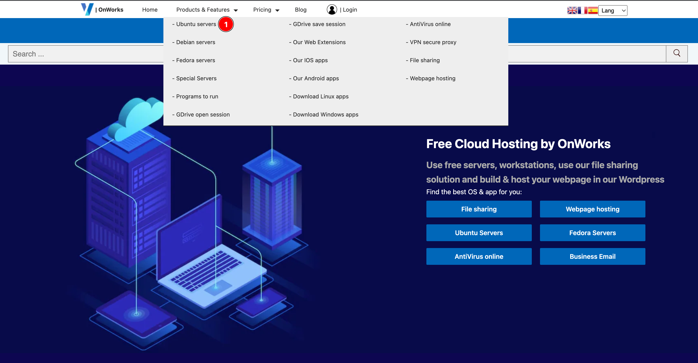

2. Look for **Ubuntu 20** and click **Read more** button.

    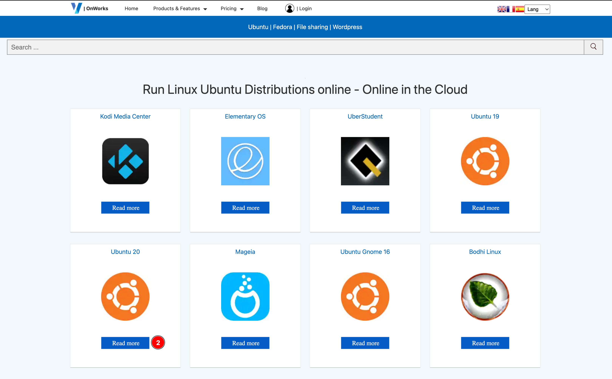

3. Click **RUN ONLINE** buttton.

    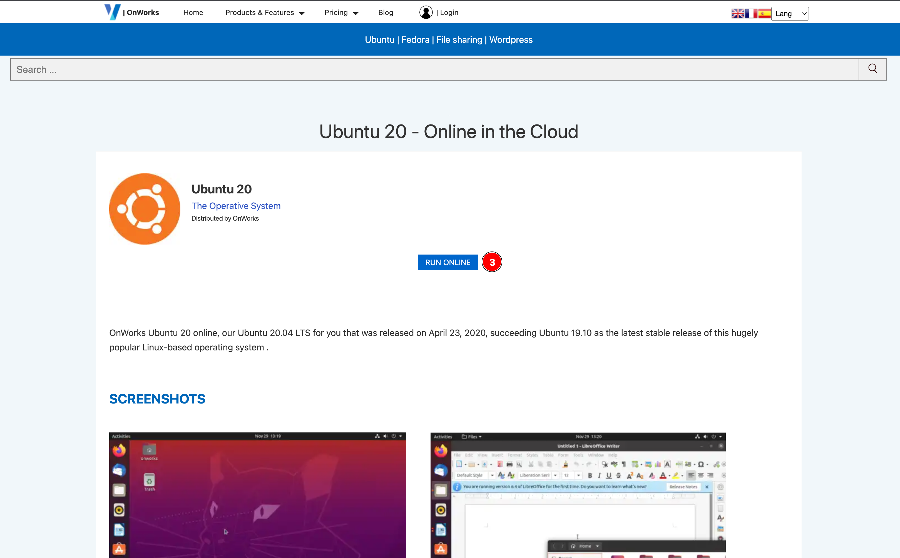

4. Click **Start** button to start provisioning.

    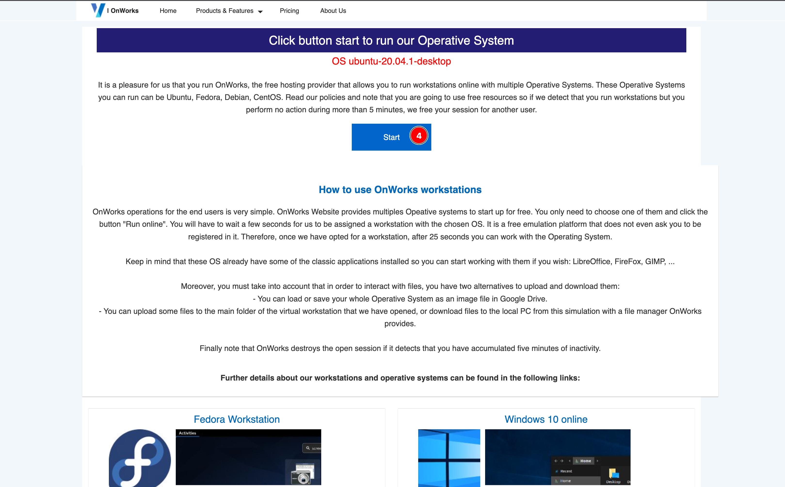

5. Wait until provisioning process success. Then click **Enter** button to open a web desktop.

    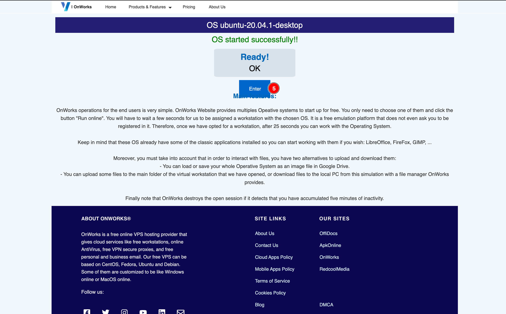

6. Click on **View** menu then uncheck **Zoom To Fit** option.

    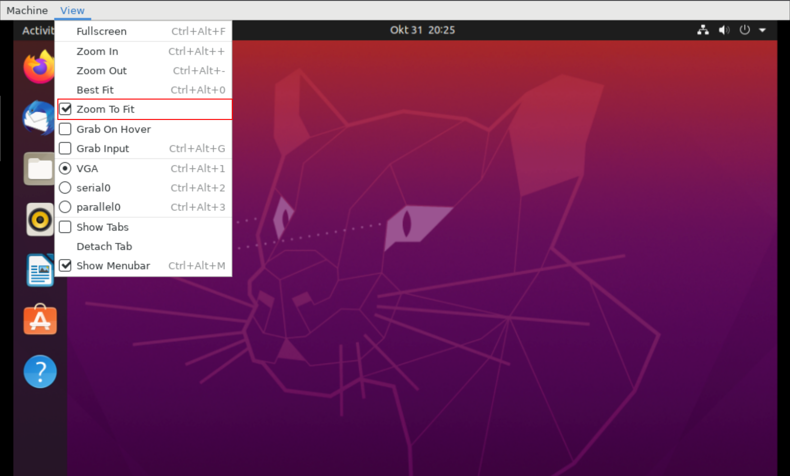

7. Click on **View** menu again then select **Fullscreen**.

    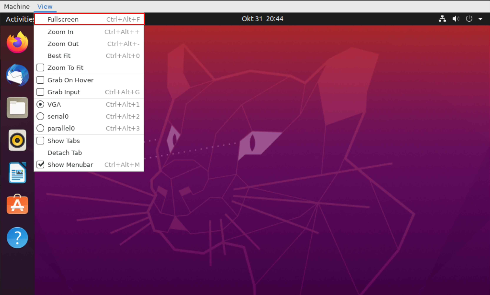

## Install Prerequisite Applications

1. Click on **Show Applications** button.

    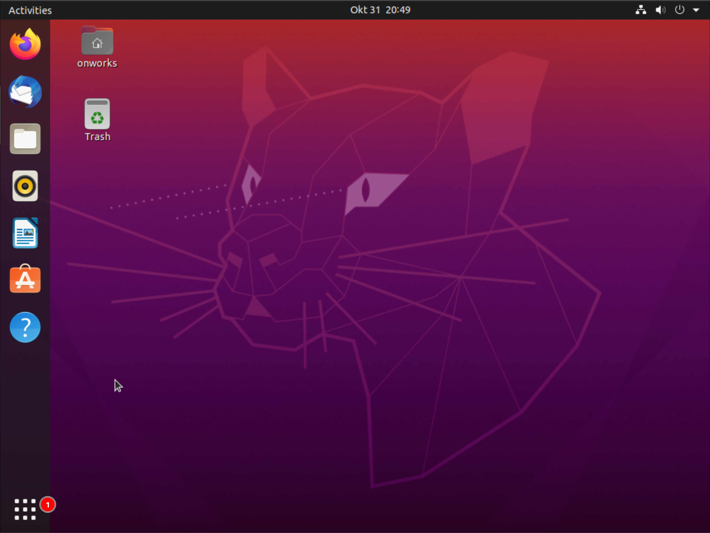

2. Type `terminal` in the search box, then click on the **Terminal** icon.

    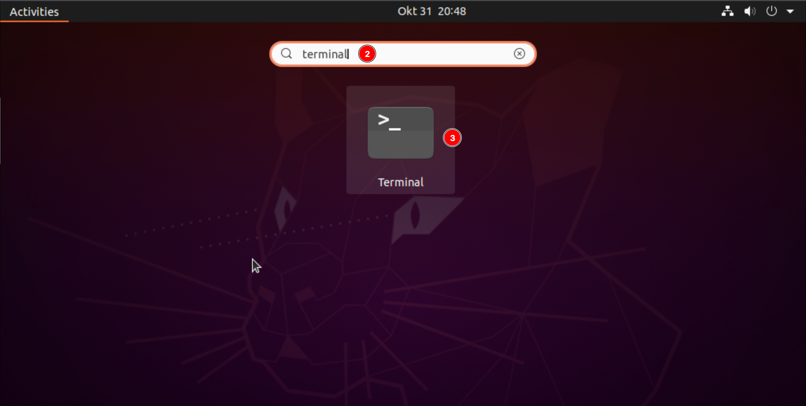

3. Type `sudo -i` command and press `Enter` to switch to `root` user. The password is `123456`

    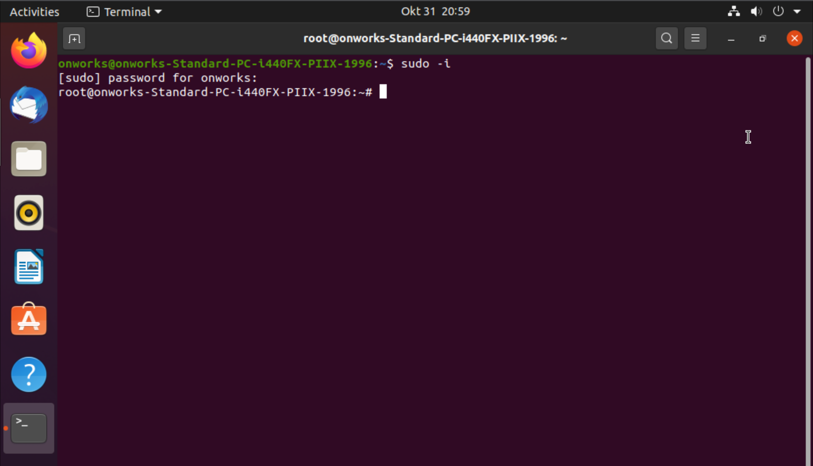

4. Run this command to install prerequisite applications

    ```sh
    apt-get update && apt-get install -y git curl
    ```

## Install Docker Using A Convenience Scripts

1. Run this command to install Docker using a convenience scripts.

    ```sh
    curl -fsSL https://get.docker.com -o get-docker.sh
    sh get-docker.sh
    ```

2. Wait until installation process success. You shoud be ablle to see output similar to this screenshot.

    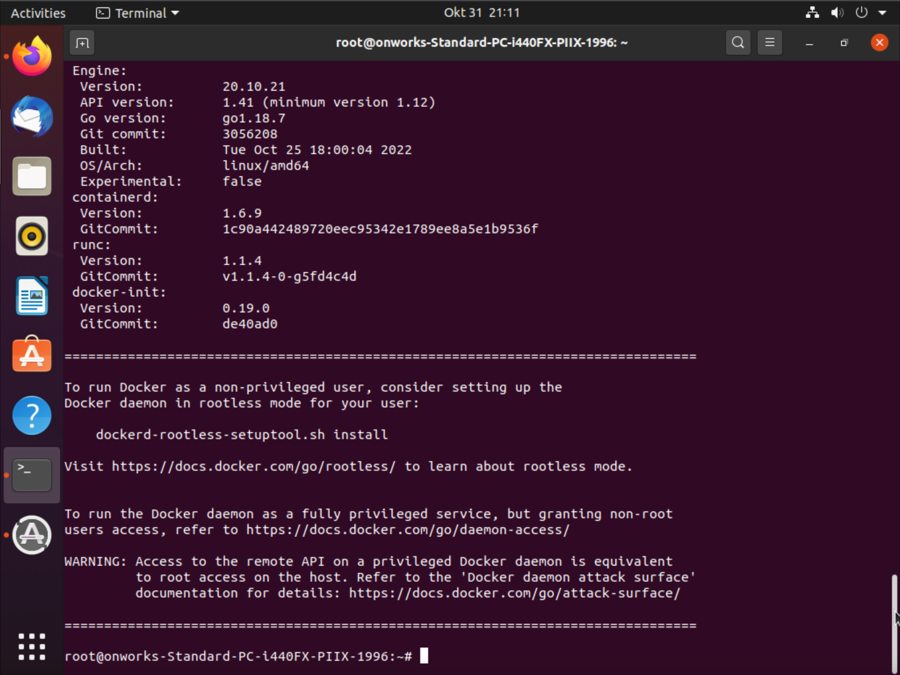
